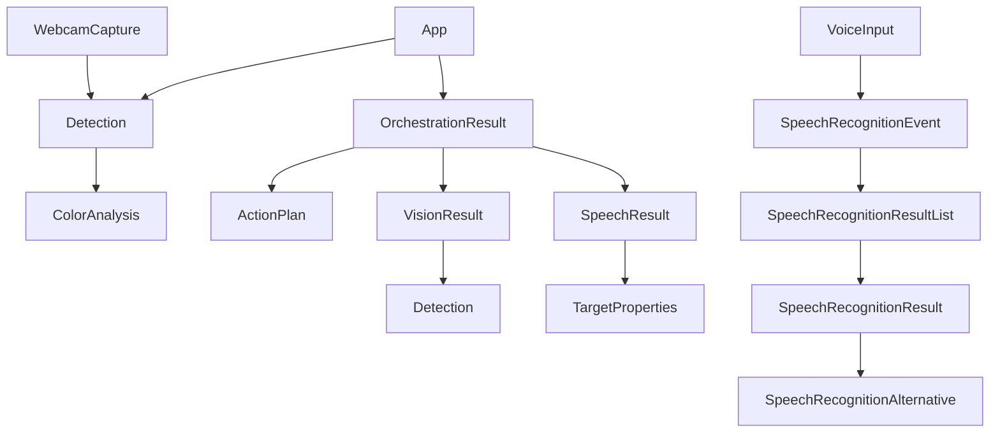
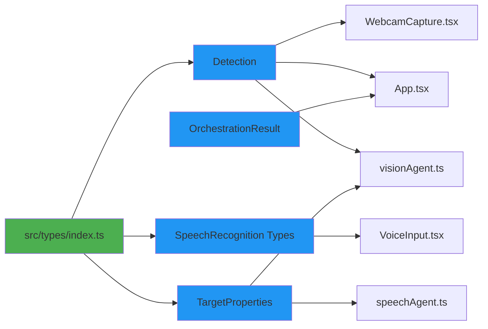

# Documento de Diseño

## Visión General

Este diseño describe cómo eliminar todos los tipos `any` del proyecto Robot Commander y reemplazarlos con tipos TypeScript específicos y seguros. El proyecto ya tiene `strict: true` habilitado en `tsconfig.app.json`, lo que es excelente, pero aún contiene varios usos explícitos de `any` que necesitan ser corregidos.

La estrategia principal es:
1. Crear tipos centralizados en un archivo de tipos compartidos
2. Definir interfaces para APIs del navegador que no tienen tipos nativos
3. Actualizar todos los archivos que usan `any` para usar los nuevos tipos
4. Validar que no haya errores de compilación

## Arquitectura

### Estructura de Tipos

Crearemos un archivo central de tipos en `src/types/index.ts` que contendrá todas las definiciones de tipos compartidos:

```
src/types/
  └── index.ts          # Tipos centralizados del proyecto
```

Este archivo exportará:
- Tipos relacionados con detecciones de ML (TensorFlow.js)
- Tipos para la API de reconocimiento de voz del navegador
- Tipos para resultados de agentes
- Tipos auxiliares y utilidades

### Flujo de Datos Tipado

```
VoiceInput (SpeechRecognition API)
    ↓ [string]
Orchestrator
    ↓ [SpeechResult]
SpeechAgent → VisionAgent → PlannerAgent → ExecutorAgent
    ↓           ↓              ↓
    [SpeechResult] [VisionResult] [ActionPlan]
    ↓
App Component [OrchestrationResult]
    ↓
RobotCanvas + WebcamCapture [Detection[]]
```

## Componentes e Interfaces

### 1. Tipos de Detección de Objetos (ML)

#### Detection Interface

```typescript
import { ColorAnalysis } from '@/ml/colorDetection';

/**
 * Representa una detección de objeto de TensorFlow.js COCO-SSD
 * con análisis de color enriquecido
 */
export interface Detection {
  /** Clase del objeto detectado (ej: 'person', 'car', 'bottle') */
  class: string;
  
  /** Confianza de la detección (0-1) */
  score: number;
  
  /** Bounding box: [x, y, width, height] */
  bbox: [number, number, number, number];
  
  /** Análisis de color opcional de la región detectada */
  colorAnalysis?: ColorAnalysis;
}
```

**Justificación del diseño:**
- `bbox` usa una tupla de exactamente 4 números para mayor seguridad de tipos
- `colorAnalysis` es opcional porque se agrega después de la detección inicial
- Todos los campos son requeridos excepto `colorAnalysis`

#### Uso en el código

Este tipo reemplazará:
- `any[]` en `WebcamCapture.tsx` (props, state, funciones)
- `any[]` en `App.tsx` (state de detections)
- `any[]` en `visionAgent.ts` (parámetro de función)
- `any` en callbacks de `forEach`, `map`, `filter`, `sort`

### 2. Tipos de API de Reconocimiento de Voz

La API de reconocimiento de voz del navegador no tiene tipos nativos en TypeScript, por lo que necesitamos definirlos:

#### SpeechRecognition Interfaces

```typescript
/**
 * Resultado individual de reconocimiento de voz
 */
export interface SpeechRecognitionAlternative {
  transcript: string;
  confidence: number;
}

/**
 * Lista de resultados de reconocimiento
 */
export interface SpeechRecognitionResult {
  readonly length: number;
  item(index: number): SpeechRecognitionAlternative;
  [index: number]: SpeechRecognitionAlternative;
  isFinal: boolean;
}

/**
 * Lista de todos los resultados
 */
export interface SpeechRecognitionResultList {
  readonly length: number;
  item(index: number): SpeechRecognitionResult;
  [index: number]: SpeechRecognitionResult;
}

/**
 * Evento de resultado de reconocimiento
 */
export interface SpeechRecognitionEvent extends Event {
  readonly resultIndex: number;
  readonly results: SpeechRecognitionResultList;
}

/**
 * Evento de error de reconocimiento
 */
export interface SpeechRecognitionErrorEvent extends Event {
  readonly error: 
    | 'no-speech'
    | 'aborted'
    | 'audio-capture'
    | 'network'
    | 'not-allowed'
    | 'service-not-allowed'
    | 'bad-grammar'
    | 'language-not-supported';
  readonly message: string;
}

/**
 * API de reconocimiento de voz del navegador
 */
export interface SpeechRecognition extends EventTarget {
  continuous: boolean;
  interimResults: boolean;
  lang: string;
  maxAlternatives: number;
  
  start(): void;
  stop(): void;
  abort(): void;
  
  onresult: ((event: SpeechRecognitionEvent) => void) | null;
  onerror: ((event: SpeechRecognitionErrorEvent) => void) | null;
  onend: (() => void) | null;
  onstart: (() => void) | null;
}

/**
 * Constructor de SpeechRecognition
 */
export interface SpeechRecognitionConstructor {
  new (): SpeechRecognition;
}

/**
 * Extensión de Window para incluir SpeechRecognition
 */
declare global {
  interface Window {
    SpeechRecognition?: SpeechRecognitionConstructor;
    webkitSpeechRecognition?: SpeechRecognitionConstructor;
  }
}
```

**Justificación del diseño:**
- Refleja la API real del navegador con precisión
- Usa tipos de unión para errores conocidos
- Extiende `EventTarget` para mantener compatibilidad con eventos del DOM
- Usa `declare global` para extender el tipo `Window` de forma segura

#### Uso en el código

Estos tipos reemplazarán:
- `(window as any).SpeechRecognition` en `VoiceInput.tsx`
- `const recognitionRef = useRef<any>(null)` → `useRef<SpeechRecognition | null>(null)`
- `(event: any)` en handlers `onresult` y `onerror`

### 3. Tipos de Propiedades de Target

#### TargetProperties Interface

```typescript
/**
 * Propiedades del objetivo que el robot debe buscar
 */
export interface TargetProperties {
  /** Nombre del objeto objetivo */
  target?: string;
  
  /** Color del objeto (ej: 'rojo', 'red') */
  color?: string;
  
  /** Dirección de movimiento */
  direction?: string;
  
  /** Propiedades adicionales */
  [key: string]: string | undefined;
}
```

**Justificación del diseño:**
- Todas las propiedades son opcionales porque dependen del comando del usuario
- Usa index signature para permitir propiedades adicionales dinámicas
- Mantiene compatibilidad con el spread operator usado en el código

#### Uso en el código

Este tipo reemplazará:
- `Record<string, any>` en `speechAgent.ts` (propiedad `properties`)
- `any` en el parámetro `targetProperties` de `analyzeDetections` en `visionAgent.ts`

### 4. Tipos de Resultados de Orquestación

Ya existe `OrchestrationResult` en `orchestrator.ts`, pero necesitamos asegurar que se use correctamente:

```typescript
// Ya existe en orchestrator.ts, solo necesitamos exportarlo y usarlo
export interface OrchestrationResult {
  speechResult: SpeechResult;
  visionResult: VisionResult;
  plan: ActionPlan;
}
```

#### Uso en el código

Este tipo reemplazará:
- `const [lastResult, setLastResult] = useState<any>(null)` → `useState<OrchestrationResult | null>(null)`

## Modelos de Datos

### Diagrama de Relaciones de Tipos



### Tipos Existentes que se Mantienen

Los siguientes tipos ya están bien definidos y no necesitan cambios:
- `ColorAnalysis` (en `src/ml/colorDetection.ts`)
- `SpeechResult` (en `src/agents/speechAgent.ts`)
- `VisionResult` (en `src/agents/visionAgent.ts`)
- `ActionPlan` y `RobotAction` (en `src/agents/plannerAgent.ts`)
- `RobotState` y `RobotActions` (en `src/store/useRobotStore.ts`)

## Manejo de Errores

### Estrategia de Tipos Seguros

1. **Validación en tiempo de compilación**: TypeScript detectará errores de tipos antes de ejecutar
2. **Tipos opcionales**: Usar `?` para propiedades que pueden no existir
3. **Tipos de unión**: Usar `| null` o `| undefined` explícitamente
4. **Type guards**: Usar verificaciones de tipos en runtime cuando sea necesario

### Ejemplo de Type Guard

```typescript
function isDetection(obj: unknown): obj is Detection {
  return (
    typeof obj === 'object' &&
    obj !== null &&
    'class' in obj &&
    'score' in obj &&
    'bbox' in obj &&
    Array.isArray((obj as Detection).bbox) &&
    (obj as Detection).bbox.length === 4
  );
}
```

## Estrategia de Testing

### Validación de Tipos

1. **Compilación sin errores**: El proyecto debe compilar sin errores después de los cambios
2. **Verificación de ESLint**: Eliminar comentarios `eslint-disable` innecesarios
3. **Pruebas manuales**: Verificar que la funcionalidad sigue funcionando correctamente

### Comandos de Validación

```bash
# Compilar TypeScript
npm run build

# Ejecutar linter
npm run lint

# Verificar tipos sin compilar
tsc --noEmit
```

## Consideraciones de Implementación

### Orden de Implementación

1. **Crear archivo de tipos** (`src/types/index.ts`)
2. **Actualizar imports** en archivos que usan tipos
3. **Reemplazar `any` en componentes** (WebcamCapture, VoiceInput, App)
4. **Reemplazar `any` en agentes** (visionAgent, speechAgent)
5. **Eliminar comentarios eslint-disable** innecesarios
6. **Validar compilación** y corregir errores

### Compatibilidad con Navegadores

- La API de `SpeechRecognition` solo está disponible en navegadores compatibles
- El código ya maneja la falta de soporte con verificaciones de existencia
- Los tipos no afectan el runtime, solo el desarrollo

### Impacto en el Rendimiento

- **Ninguno**: Los tipos de TypeScript se eliminan en la compilación
- El código JavaScript generado será idéntico
- Solo mejora la experiencia de desarrollo

## Alternativas Consideradas

### Alternativa 1: Usar bibliotecas de tipos de terceros

**Pros:**
- Tipos ya definidos y mantenidos
- Menos código propio

**Cons:**
- No existe una biblioteca de tipos oficial para SpeechRecognition
- Las bibliotecas de terceros pueden estar desactualizadas
- Dependencia adicional

**Decisión:** Definir tipos propios para máximo control

### Alternativa 2: Mantener algunos `any` con comentarios

**Pros:**
- Menos trabajo inicial
- Flexibilidad en casos complejos

**Cons:**
- Pierde los beneficios de TypeScript
- Puede ocultar bugs
- Mala práctica

**Decisión:** Eliminar todos los `any` para máxima seguridad de tipos

### Alternativa 3: Usar `unknown` en lugar de tipos específicos

**Pros:**
- Más seguro que `any`
- Fuerza validación en runtime

**Cons:**
- Requiere type guards en todas partes
- Menos conveniente para desarrollo
- No aprovecha el sistema de tipos

**Decisión:** Usar tipos específicos para mejor DX (Developer Experience)

## Diagrama de Arquitectura



## Resumen de Cambios por Archivo

| Archivo | Cambios | Tipos Nuevos Usados |
|---------|---------|---------------------|
| `src/types/index.ts` | **CREAR** | Detection, SpeechRecognition*, TargetProperties |
| `src/components/WebcamCapture.tsx` | Reemplazar 5 usos de `any` | Detection |
| `src/components/VoiceInput.tsx` | Reemplazar 4 usos de `any` | SpeechRecognition, SpeechRecognitionEvent, SpeechRecognitionErrorEvent |
| `src/App.tsx` | Reemplazar 2 usos de `any` | Detection, OrchestrationResult |
| `src/agents/visionAgent.ts` | Reemplazar 5 usos de `any` | Detection, TargetProperties |
| `src/agents/speechAgent.ts` | Reemplazar 1 uso de `any` | TargetProperties |
| `tsconfig.app.json` | Sin cambios (ya tiene `strict: true`) | N/A |

**Total:** 17 usos de `any` eliminados, 3 nuevos tipos principales creados
